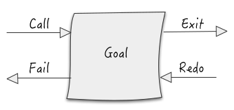
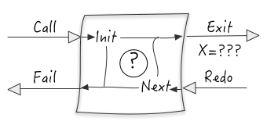
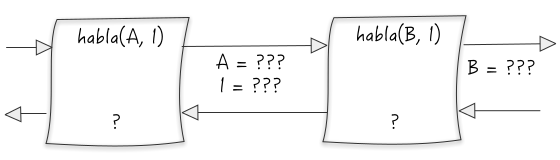
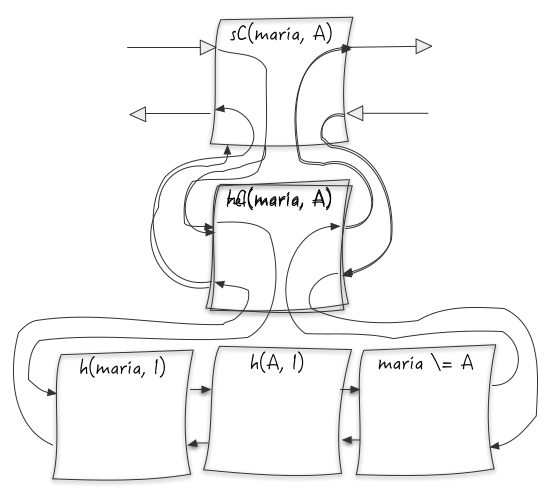

> Los links en el artículo muestran animaciónes que van llevando el relato. Están ideados para ser presionados en orden.

## La sesión con el usuario

Un programa en Prolog se conforma de una serie de reglas. Pero antes de ver qué aspecto tiene veamos qué esperamos al ejecutarlo.

El usuario al usar un programa Prolog indicará un [goal u objetivo](#ref:g1_goal) del cual espera obtener soluciones en caso de que existan. La ejecución es la búsqueda de múltiples soluciones. Siempre.

<center id="g1">



</center>

Al [iniciar la búsqueda](#ref:g1_call) se usarán las reglas definidas para obtener [una primera solución](#ref:g1_exit). A continuación el usuario podrá, luego de analizar la solución, [pedir otra](#ref:g1_redo). El programa mantiene un estado para seguir con la búsqueda. Suponiendo que exista una segunda solución, se informa [de la misma manera](#ref:g1_exit) y se podrá [repetir](#ref:g1_redo) [el](#ref:g1_exit) [proceso](#ref:g1_redo). Eventualmente (si todo funciona bien) el programa indicará que [no hay más soluciones](#ref:g1_fail).

Ésta es la manera en la que el usuario interactura con un intérprete de Prolog. Veremos también que es una forma de entender cómo funciona un programa paso a paso.

## Un primer programa

El programa más simple sería una enumeración explícita de **hechos**.

```prolog
habla(juan, ruso).
habla(juan, inglés).
habla(maría, inglés).
habla(pedro, ruso).
```

Una consulta estará formada por al menos una cláusula. En este caso hay una **variable sin instanciar** `X` y una **constante** `ruso`.

```
?- habla(X, ruso).
```

Es fácil ver que las soluciones posibles son aquellas donde `X=juan` y luego `X=pedro`.

Para obtenerlas, se recorren una por una las definiciones que coincidan, o **unifiquen** con `habla(X, ruso)`. Internamente se puede pensar en un cursor que recorre los hechos a medida que se van pidiendo soluciones.

En un [primer paso](javascript:g2s1()) se inicializa la consulta y el cursor se ubicará en la definición del primer hecho, que, como coincide con `habla(X, ruso)`, se **unifica** `X=juan` obteniendo la primer solución.

Luego el usuario podrá pedir una [segunda solución](javascript:g2s2()). A continuación se buscarán las siguientes definiciones que puedan unicar con `habla(X, ruso)`. Esto se logra recién en la última definición, dando lugar al [segundo resultado](javascript:g2s3()), unificando ahora `X=pedro`. Notar que cada solución tiene una instanciación distinta en las variables.

Al pedir una [tercera solución](javascript:g2s4()) no se encontrarán más definiciones que unifiquen con el objetivo y se informará que no hay más soluciones.

<center id="g2" class="graph graph--h">

<div class="graph-code">
    <code class="l1">habla(juan, ruso).</code>
    <code class="l2">habla(juan, inglés).</code>
    <code class="l3">habla(maría, inglés).</code>
    <code class="l4">habla(pedro, ruso).</code>
    <br/>
    <div class="l5"><code>?- habla(X, ruso).</code><span class="n">↵</span></div>
    <div class="l6"><code>X = juan</code><span class="n">;↵</span></div>
    <div class="l7"><code>X = pedro</code><span class="n">;↵</span></div>
    <div class="l8"><code>fail</code></div>
    <br/>
</div>



</center>


## Goals compuestos

Las consultas pueden estar formadas por más de una cláusula.

```prolog
?- habla(A, I), habla(B, I)
```

Siguiendo con la analogía de las cláusulas como cajas, cada vez que se obtenga un resultado para la primera, se buscarán los resultados de la segunda. Es importante notar que cada clásula se resuelve teniendo en cuenta *todas* las definiciones y el valor de las variables en ese momento.

<center id="g3" class="graph graph--v">

<div style="display: flex; flex-direction: row">

<div class="graph-code" style="padding: 20px 0px;">
  <code class="l1">habla(juan, ruso).</code>
  <code class="l2">habla(juan, inglés).</code>
  <code class="l3">habla(maría, inglés).</code>
  <code class="l4">habla(pedro, ruso).</code>
  <br/>
  <code class="l5">?- habla(A, I), habla(B, I).</code>
</div>

<div class="graph-code">
  <code class="l6">A = juan, B = juan, I = ruso;</code>
  <code class="l7">A = juan, B = pedro, I = ruso;</code>
  <code class="l8">A = juan, B = juan, I = inglés;</code>
  <code class="l9">A = juan, B = maría, I = inglés;</code>
  <code class="l10">A = maría, B = juan, I = inglés;</code>
  <code class="l11">A = maría, B = maría, I = inglés;</code>
  <code class="l12">A = pedro, B = juan, I = ruso;</code>
  <code class="l13">A = pedro, B = pedro, I = ruso.</code>
</div>

</div>




</center>

[En](javascript:g3g(1)) [total](javascript:g3g(2)) [hay](javascript:g3g(3)) [ocho](javascript:g3g(4)) [soluciones](javascript:g3g(5)) [para](javascript:g3g(6)) [el](javascript:g3g(7)) [goal](javascript:g3g(8)).

Para evitar las soluciones que se refieren a la misma persona se podría agregar la cláusa `A \= B` al final. Dicha cláusula tendrá solución si los valores son distintos.

```prolog
?- habla(A, I), habla(B, I), A \= B.
```

## Reglas

La definición de predicados pueden ser, además de *hechos*, reglas.
Por ejemplo podríamos definir el predicado `hablaCon/2` que represente si dos personas pueden hablar directamente una con la otra. El `/2` indica que es un predicado binario.

```prolog
hablaCon(A, B) :- habla(A, I), habla(B, I), A \= B.
```

Tal como un predicado puede constar de multiples definiciones de hechos, lo mismo sucede con las definiciones de reglas.

```prolog
telepatía(maría, pedro).

seComunican(A, B) :- telepatía(A, B).
seComunican(A, B) :- hablaCon(A, B).
```

De esta forma `A` y `B` se comunican si tienen telepatía entre ellos o si pueden hablar (por compartir un idioma común).

Si bien no se exhibe, un predicado puede definirse en forma mezclada por hechos y reglas.

Cuando una cláusula que se intenta resolver corresponde a un predicado con múltiples definiciones se van iterando por las disintas definiciones que unifican. En los ejemplos anteriores eran hechos y por ende se resolvían directamente. Cuando la definición es una regla, se expanden las cláusulas

Al principio se intentará resolver usando [la primera](javascript:g4s1()) definición. En este caso queda como nuevo goal, luego de unificar y sustituir los parámetros, `telepatía(maría, A)`.

En la búsqueda de otra solución se pasará, luego de que se propaguen los _fail_, a [la segunda](javascript:g4s2()) definición. Para resolverla se terminará usando la [única regla](javascript:g4s3()) para `hablaCon(maría, A)`.

<center id="g4" class="graph graph--v" style="flex-direction: column">

<div class="graph-code">
  <code class="l1">habla(juan, ruso).</code>
  <code class="l2">habla(juan, inglés).</code>
  <code class="l3">habla(maría, inglés).</code>
  <code class="l4">habla(pedro, ruso).</code>
  <br/>
  <code class="l5">hablaCon(A, B) :- habla(A, I), habla(B, I), A \= B.</code>
  <br/>
  <code class="l6">telepatía(maría, pedro).</code>
  <br/>
  <code class="l7">seComunican(A, B) :- telepatía(A, B).</code>
  <code class="l8">seComunican(A, B) :- hablaCon(A, B).</code>
  <br/>
  <code class="l9">?- seComunican(maría, A).</code>
</div>



</center>


## El árbol (de backtracking)

El recorrido hasta ahora se corresponde con un recorrido [DFS](https://en.wikipedia.org/wiki/Depth-first_search) del árbol de ejecución.

Una vez que se comprende que el lenguaje permite expresar en forma concisa algorítmo de _backtracking_ se puede ver la ejecucíon de un programa desde otras perspectivas.

Al fijar el goal inicial, se pueden tener las variables visibles al usuario de las cuales espera saber su valor en caso de encontrar una solución.

En el ejemplo anterior

  **1)** `seComunican(maría, A)` con `A = ?`.

A continuación se puede dar un paso en resolver el _goal_. Esto se hace encontrando definiciones que unifican con la primer cláusla del _goal_. Como son reglas se deberá expandir el cuerpo de la misma como nuevo goal. Este proceso da varios resultados que eventualmente darán origen a las soluciones.

  **1.1)** `telepatía(maría, A)` con `A = ?`.

  **1.2)** `hablaCon(maría, A)` con `A = ?`.

Cada vez que se usa una definición hay que tener en cuenta la sustitución de la unificación. La `A` de las definiciones se correspondian con `maría` y las `B` con las `A` del goal.

Siguiendo con la rama **1.1**, se usa la definición de un hecho. En este caso no se agrega ninguna cláusula dejando el goal vació `⟂` e indicando una solución al goal original.

  **1.1.1)** `⟂` con `A = pedro`.

Entonces cada vez que se encuentra una definición para la primer claúsula, se la reemplaza por la parte derecha de la misma. Si en algún momento no se puede reemplazar la cláusula esa rama falla.

La rama *1.2* da origen a:

  **1.2.1)** `habla(maría, I), habla(A, I), maría \= A` con `A = ?`.

Como solo hay un hecho que unifica con `habla(maría, I)` la rama *1.2.1* da origen a:

  **1.2.1.1)** `habla(A, inglés), maría \= A` con `A = ?`.

Notar que ya no importa por qué se busca alguién que hable inglés.

Como hay dos hechos que unifican con `habla(A, inglés)` la última rama da origen a:

  **1.2.1.1.1)** `maría \= juan` con `A = juan`.

  **1.2.1.1.2)** `maría \= maría` con `A = maría`.

La primera reduce a:

  **1.2.1.1.1.1)** `⟂` con  `A = juan`.

mientras que la segunda falla.

A continuación se muestra el árbol completo. Al hacer click en los nodos se muestra la información que se usó para ese paso.

<svg id="tree">
</svg>

Y se puede elegir [ver dicha información según el algoritmo de resolución](javascript:toggleResolution()).

## Referencias

* [The Byrd Box Model And Ports](https://www.swi-prolog.org/pldoc/man?section=byrd-box-model)
* [https://www.swi-prolog.org/](http://www.swi-prolog.org/)
* [https://www.amzi.com/AdventureInProlog](http://www.amzi.com/AdventureInProlog)
