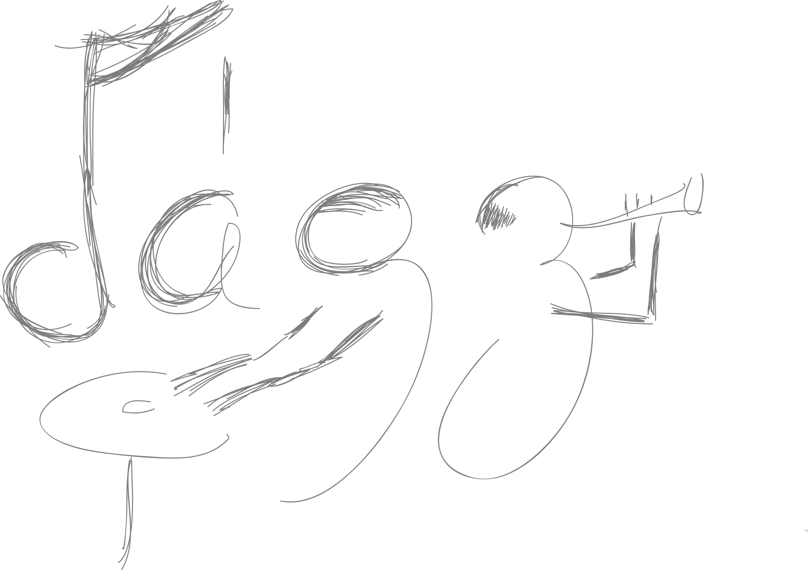

This page exists to eyeball the rendering of each construct. It is a draft, so it only appears under `astro dev`.

## Links and underlines

Three links with three squiggle variants: [alpha](https://example.com/a), [beta](https://example.com/b), [delta](https://example.com/c), and a link wrapping inline code, [`git range-diff`](https://git-scm.com/docs/git-range-diff). If all three underlines look the same, change a word and check the `data-squig` attribute.

## Lists

- An unordered list item with *emphasis* and **strong** text.
- A second item with `inline code`.

1. First ordered item.
2. Second ordered item.

## Figures

A plain figure, caption from the alt text:



A framed figure, hatch behind the drawing, pencil frame on top:


## Pull quotes

> A short quote, to see the bracket at one line.

> A longer quote that wraps to a second line so the bracket stretches, and then keeps going for a third line to be sure of it.

> A third quote so that, with luck, all three bracket variants show up on this page.

## Code

```crystal
class Greeter
  def initialize(@name : String)
  end

  # Say hello
  def greet : String
    "Hello, #{@name}!"
  end
end
```

```haskell
fib :: Int -> Integer
fib n = fibs !! n
  where fibs = 0 : 1 : zipWith (+) fibs (tail fibs) -- lazy list
```

```prolog
% ancestor/2
ancestor(X, Y) :- parent(X, Y).
ancestor(X, Y) :- parent(X, Z), ancestor(Z, Y).
```

```shell
# rebuild and serve
npm run build && npm run preview
```

```
A block with no language.
```

## Math

Inline: the golden ratio is $\varphi = \frac{1 + \sqrt{5}}{2}$.

Display:

$$
\sum_{k=1}^{n} (2k - 1) = n^2
$$

## Table

| Language | Paradigm | First taught |
| --- | --- | --- |
| Prolog | Logic | 2014 |
| Haskell | Functional | 2015 |
| Crystal | Object oriented | 2016 |
